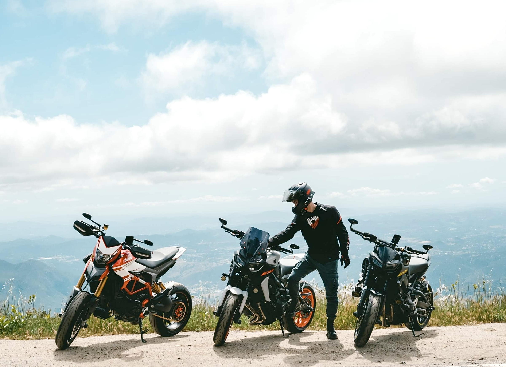

## Welcome to Jason's Page.

[About me](#welcome-to-jasons-page)

[Academic Process](#academic-process)

[Experiences](#experiences)

### Hello...This is [Jason!](IMG-3498.jpg) 

***I'm a student studying Computer Science at the University of California, San Diego (UCSD).***

***Contact email***: *j8bui@ucsd.edu*



*I'm passionate about technology and programming, and I'm excited to be pursuing a career in the field.I'm looking forward to continuing to grow and develop my skills to make a positive impact in the tech industry.*

✌️ **Enjoying things**✌️

     ✔️ Riding motorcycle 
     
     ✔️ Hiking 
     
     ✔️ Building PCs 
     
```java
try {
     tellJoke();
} catch(NotFunnyException e) {
     logger.error("You are not funny", e);
}
```

### Academic Process

- [x] Fall 2022
- [x] Winter 2023
- [ ] Spring 2023

As a transfer student from community college, I'm not used to with the quarter system at UCSD. It's too fast too furious!

>"Start Early, Start Often"

This is a catchphrase widely joked about in UCSD’s computer science community, but I believe it applies to all fields of study. In the quarter system, everything moves so fast it might make you nauseous if you’re not used to it.

### Experiences:

Through my coursework and projects at UCSD, I've gained experience in programming languages such as:
1. Java : from [CSE 12 - Basic Data Structures and Object-Oriented Design.](https://ucsd-cse12-f22.github.io/syllabus.html)
2. C++ : from [CSE 100 - Advanced Data Structures.](https://cseweb.ucsd.edu/classes/sp20/cse100-c/)
3. SystemVerilog: from [CSE 140 - Components and Design Techniques for Digital Systems.](https://cseweb.ucsd.edu/classes/wi22/cse140-ab/)

I also learned about:
- [Computer systems.](https://sites.google.com/eng.ucsd.edu/cse140lwi23/home)
- [Algorithms.](https://cseweb.ucsd.edu/classes/s222/cse101-a/)
- [Data structures](https://cseweb.ucsd.edu/classes/sp20/cse100-c/)
- [Software tools and techniques.](https://ucsd-cse15l-f22.github.io/) 


There are some projects I've done so far:
- Github in [CSE 15L](https://jasonb1910.github.io/cse-15l-lab-reports/)
- Block-based coding in [EDS 124BR](EDS124BR.md)
  

